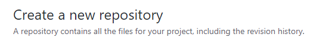
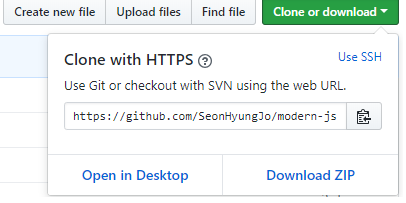

# :apple: Chapter 1

## Init npm package

- Create Github repo
- Create License file
- Init npm => pakage.json

기본적인 작업을 하기 위해서는 공간이 필요하다. 흔히 WorkSpace라 불리는 우리만의 작업공간이 필요한 것이다. 그러한 작업공간이 서버에 올라와 있다면 내가 어디서 어떤 PC로 작업을 하든 같은 소스를 바라볼 수 있으며, 다른 사람들과 협업을 하는데 있어서 소스를 일일히 보내면서 공유를 하지 않아도 되는 이점을 가진다.

이럴때 사용하는 곳이 있다. 이미 많은 분들이 알고 있는 **Github, GitLab, Bitbucket** 이 있다. 이외에 다른 것이 있겠지만 제가 애용하는 곳은 Github입니다. 최근 Github가 MS에 인수가 되고 private가 일부 무료화가 되는 사건? 이 있었습니다.

> [호스팅 3대장 비교글 읽어보기](https://m.blog.naver.com/PostView.nhn?blogId=dlwhdgur20&logNo=221006619001&proxyReferer=https%3A%2F%2Fwww.google.com%2F)

## Github

먼저 작업을 하는데 있어 Github계정이 필요합니다. [Github](https://github.com/)에 들어가셔서 아이디를 만들고 로그인을 합니다.

이제 Repogitory라는 하나의 공간을 만듭니다.



Repo의 이름은 자유롭게 하시되, Add a License를 클릭해서 라이센스는 MIT로 하겠습니다.
이렇게 하여 Repo를 만드는 것과 License 파일을 만드는 작업이 끝났습니다.

이제 실질적으로 코딩을 하기 위해서 내 컴퓨터에 받습니다.



Repo안에서 위에서 처럼보이는 주소를 복사를 하고, window의 경우 powershell를 키시고 적당한 위치로 이동을 하시고 아래 내용을 입력합니다.

```
  git clone <user_github_address>
```

이렇게 하면 Repo 이름과 동일한 폴더가 생성이 됩니다.

이제 코딩을 하기 위해서 에디터를 설치합니다. 저의 경우는 VSCode를 사용합니다.

## npm init

npm은 간단하게 node package manager로 Node.js로 만들어진 pakage(module)을 관리해주는 툴입니다. 

우리가 JS를 함에 있어서는 없어서는 안되는 툴입니다. 먼저 npm를 이용해서 패키지 정보를 init 합니다.

```
  npm init
```

위의 명령어를 입력하고 적정하게 입력을 하고 넘어가게 되면 package.json이라는 파일이 만들어지고 초기 셋팅을 완료가 됩니다.

:green_apple: [Chapter 2 바로가기](https://github.com/SeonHyungJo/modern-js-starter/tree/CH-2)